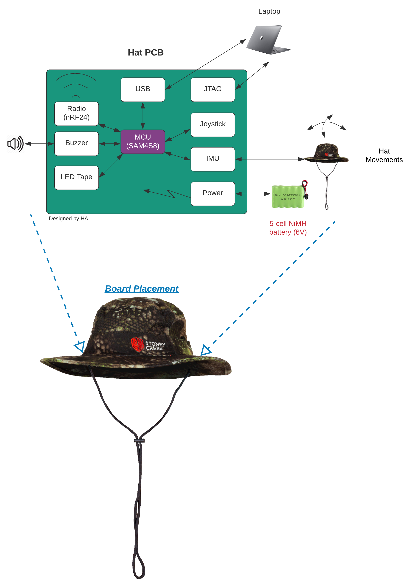
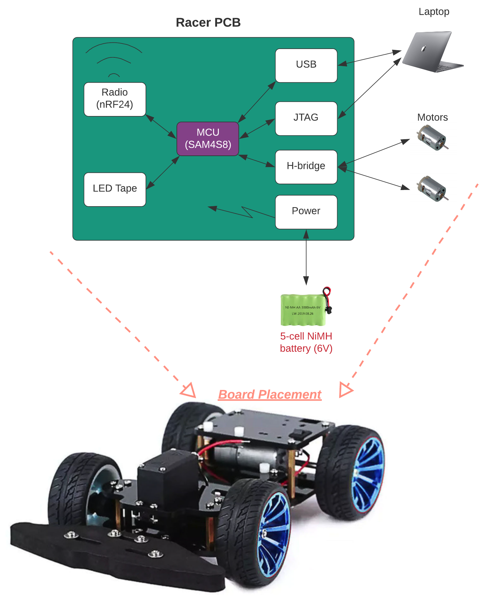

Wacky Races Project
===================
. 

Description
===========
This project was inspired by the infamous cartoon series Wacky Races which involve designing unique vehicles for each charecters that match their personalities. This project aimed to bring the series into an embedded systems reality.

The purpose of this assignment was to design, build, and program an embedded system using Atmel SAM4S8 microcontroller and surface mount techmology. The goal of this assignment was to build the Wacky Racer (the vehicle controller) and Wacky Hat (the driver board) in Altium Designer, to populate the board using surface mount technologies (SMT), and to
program the two boards in C to communicate with each other via nRF24 radio module.

Requirements
============
## Wacky Racer
* Must design a 4-layer PCB of dimension 85mmX64mm
* Use a USB interface for debugging
* Use a serial wire debug interface for MCU programming/debugging
* Must include an addequate fusing and reverse polarity protection
* Must have a sleep button
* Have afour jumber selected radio channels
* Interface with Wacky Hat board with a Nordic nRF24 SMD radio module
* Must include a low-battery-LED indicator
* Must be decorated with an LED tape controlled by the MCU
* Must regulate the nominal battery voltage to 5V with ADP2302ARDZ-50
* Drive the motors using H-briges (DRV8833)
* Use USB and JTAG interfaces for debugging

## Wacky Hat
* Must design a 4-layer PCB of dimension 85mmX64mm
* Use a USB interface for debugging
* Use a serial wire debug interface for MCU programming/debugging
* Must include an addequate fusing and reverse polarity protection
* Must have a sleep button
* Have afour jumber selected radio channels
* Interface with Wacky Hat board with a Nordic nRF24 SMD radio module
* Must include a low-battery-LED indicator
* Must be decorated with an LED tape controlled by the MCU
* Must regulate the nominal battery voltage to 5V with ADP2302ARDZ-50
* Use I2C IMU (MPU-9250) for head motion detection
* Use USB and JTAG interfaces for debugging

Project Output
==============

Contributors
============
* [Hassan Alhujhoj](https://github.com/hassan-alhujhoj)
* [Marcus Hughan](https://github.com/marcusHughan)
* [Nathan James](https://github.com/natedawgsnz)
* [Abdullah Naeem](https://eng-git.canterbury.ac.nz/ana104)

License
=======
Licensed under [MIT License](LICENSE)
